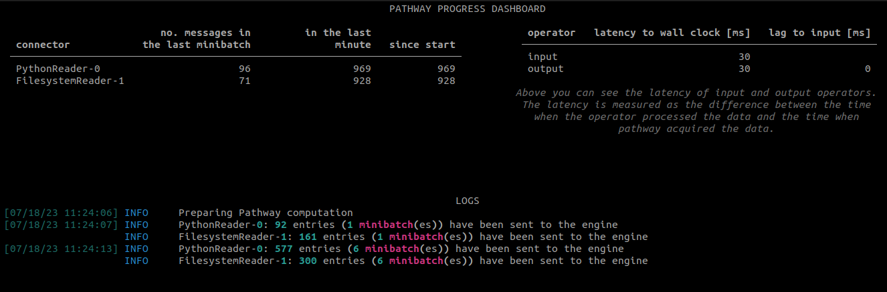

<div align="center">
  <br /><br />
</div>
<p align="center">
    <a href="https://github.com/pathwaycom/pathway/blob/main/LICENSE">
        </a>
        
        
      <br>
    <a href="https://discord.gg/pathway">
        </a>
    <a href="https://twitter.com/intent/follow?screen_name=pathway_com">
        </a>
</p>

[Pathway](www.pathway.com) is an open-source Python framework designed to efficiently process large volumes of data in real-time with minimal delay. With Pathway, you can switch between batch processing and streaming effortlessly, as its powerful Rust engine manages and automatically updates the data pipeline whenever new data is received.


Pathway provides a high-level, functional programming style interface in Python for defining data transformations, aggregations, and other operations on data streams.
With Pathway, you can effortlessly design and deploy sophisticated data workflows that efficiently handle high volumes of data in real time.


Typical use-cases of Pathway include realtime data processing, ETL (Extract, Transform, Load) pipelines, and data analytics.
The library interoperates with various data sources and sinks such as Kafka, CSV files, and databases, allowing you to connect and process data from different storage systems.

In Pathway, data is represented in the form of tables. The library provides a rich set of operations like filtering, joining, grouping, and windowing.

Stay up to date with the latest developments and news surrounding Pathway by regularly visiting our [blog](https://pathway.com/blog/), and be sure to subscribe to our [newsletter](https://pathway.com/blog?modal=newsletter) for timely updates.  
You have a question? Feel free to reach out to us directly on [Discord](https://discord.com/invite/pathway) or through our [forum](https://forum.pathway.com/) for prompt assistance and support.

## Installation

Pathway requires Python 3.9 and above.

You can install the current release of Pathway using `pip`:

```
$ pip install -U --extra-index-url https://packages.pathway.com/966431ef6ba pathway
```

⚠️ Pathway is available on MacOS and Linux. Pathway is currently not supported on Windows.

## Getting started

To use Pathway, you only need to import it:

```python
import pathway as pw
```

Now, you can easily create your processing pipeline while letting Pathway handle the updates. Once your pipeline is created, you can launch the computation on streaming data by a one-line command:

```python
pw.run()
```

You can then run your Pathway project as a normal python with `python main.py` or use the Pathway version:

```
$ pathway spawn python main.py
```

Pathway natively supports multiprocessing and multithreading.
To launch your application with 2 processes, having 3 threads each, you can do as follows:
```
$ pathway spawn --processes 2 --threads 3 python main.py
```

> To jumpstart a Pathway project, you can use our [cookiecutter template](https://github.com/pathwaycom/cookiecutter-pathway).


### Example

```python
import pathway as pw

# Using the `demo` module to create a data stream
table = pw.demo.stream_sum_example(nb_rows=50)
# Storing the stream into a CSV file
pw.io.csv.write(table, "output_table.csv")

# Summing all the values in a new table
sum_table = table.reduce(sum=pw.reducers.sum(pw.this.value))
# Storing the sum (which is a stream) in another CSV file
pw.io.csv.write(sum_table, "sum_table.csv")

# Now that the pipeline is built, the computation is started
pw.run()
```

Run this example in [colab](https://colab.research.google.com/drive/1kLx5-vKKg0IeQ88ydS-ehtrxSujEZrXK?usp=sharing)!

## Resources

### Guides 
- [Core concepts of Pathway](https://pathway.com/developers/user-guide/introduction/key-concepts/)
- [Basic operations](https://pathway.com/developers/user-guide/introduction/survival-guide/)
- [Joins](https://pathway.com/developers/user-guide/table-operations/join-manual/)
- [Groupby](https://pathway.com/developers/user-guide/table-operations/groupby-reduce-manual/)
- [Windowby](https://pathway.com/developers/user-guide/table-operations/windowby-reduce-manual/)
- [Transformer classes](https://pathway.com/developers/user-guide/transformer-classes/transformer-intro/)
- [Input and output connectors](https://pathway.com/developers/user-guide/input-and-output-streams/connectors/)
- [Coming from pandas](https://pathway.com/developers/user-guide/migrate-from-pandas/)
- [API docs](https://pathway.com/developers/api-docs/pathway)
- [Troubleshooting](https://pathway.com/developers/user-guide/introduction/troubleshooting/)

### Tutorials
- [Linear regression on a Kafka Stream](https://pathway.com/developers/tutorials/linear_regression_with_kafka/) ([video](https://vimeo.com/805069039)) 
- Joins:
  - [Interval joins](https://pathway.com/developers/tutorials/fleet_eta_interval_join/)
  - [Window joins](https://pathway.com/developers/tutorials/clickstream-window-join/)
  - [ASOF joins](https://pathway.com/developers/tutorials/finance_ts_asof_join/)
- Connectors:
  - [CSV connectors](https://pathway.com/developers/tutorials/connectors/csv_connectors/)
  - [Database connectors](https://pathway.com/developers/tutorials/connectors/database-connectors/)
  - [Kafka connectors](https://pathway.com/developers/tutorials/connectors/kafka_connectors/)
  - [Custom Python connector](https://pathway.com/developers/tutorials/connectors/custom-python-connectors/)
  - [Switching from Kafka to Redpanda](https://pathway.com/developers/tutorials/connectors/switching-to-redpanda/)
- [Monitoring Pathway with Prometeus](https://pathway.com/developers/tutorials/prometheus-monitoring/)
- [Time between events in a multi-topic event stream](https://pathway.com/developers/tutorials/event_stream_processing_time_between_occurrences/)

### Showcases
- [Realtime Twitter Analysis App](https://pathway.com/developers/showcases/twitter/)
- [Realtime classification with Nearest Neighbors](https://pathway.com/developers/showcases/lsh/lsh_chapter1/)
- [Realtime Fuzzy joins](https://pathway.com/developers/showcases/fuzzy_join/fuzzy_join_chapter1/)

### Videos
- LLM (coming soon)
- [Introduction to reactive data processing](https://pathway.com/developers/user-guide/introduction/welcome)
- [Linear regression on a Kafka Stream](https://vimeo.com/805069039)

### Community
- [Real-time linear regression (Data Engineering Weekly)](https://pathway.com/developers/tutorials/unlocking-data-stream-processing-1/)
- [Realtime server logs monitoring (Data Engineering Weekly)](https://pathway.com/developers/tutorials/unlocking-data-stream-processing-2/)
- [Data enrichment with fuzzy joins (Data Engineering Weekly)](https://pathway.com/developers/tutorials/unlocking-data-stream-processing-3/)


## Monitoring Pathway

Pathway comes with a monitoring dashboard. It allows you to keep track of the number of messages sent by each connector and the latency of the system. It also includes log messages. It is enabled by default. You can disable it by passing `monitoring_level = pathway.MonitoringLevel.NONE` to `pathway.run()`.



In addition to Pathway's built-in dashboard, you can use [Prometeus](https://pathway.com/developers/tutorials/prometheus-monitoring) to monitor your Pathway application.

## Performances
TODO

## Coming soon
Pathway continues to evolve and enhance its capabilities. Here are some exciting new features that we plan to incorporate in the near future:
- Enhanced monitoring, observability, and data drift detection, seamlessly integrated with the powerful visualization capabilities of Grafana.
- New connectors enabling Pathway to connect new data sources such as Delta Lake and Snowflake.


## Contributions guidelines
TODO

## Repository organization
TODO

## License
TODO , see the [license file](LICENSE.txt) for more info.

To buy a commercial license, please contact to us at [contact@pathway.com](contact@pathway.com).